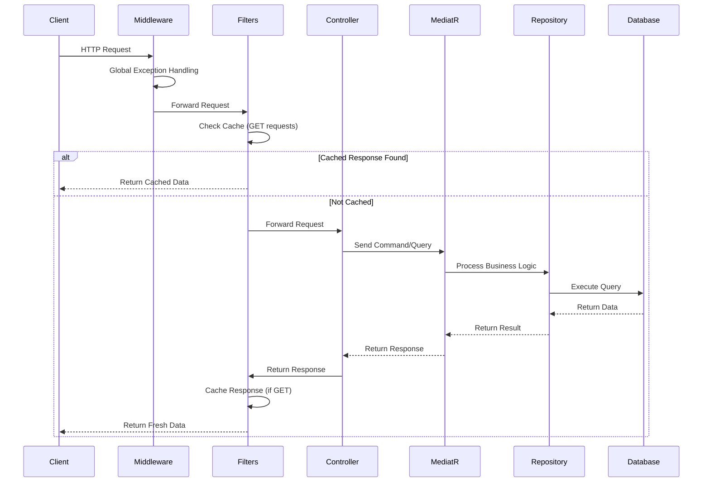
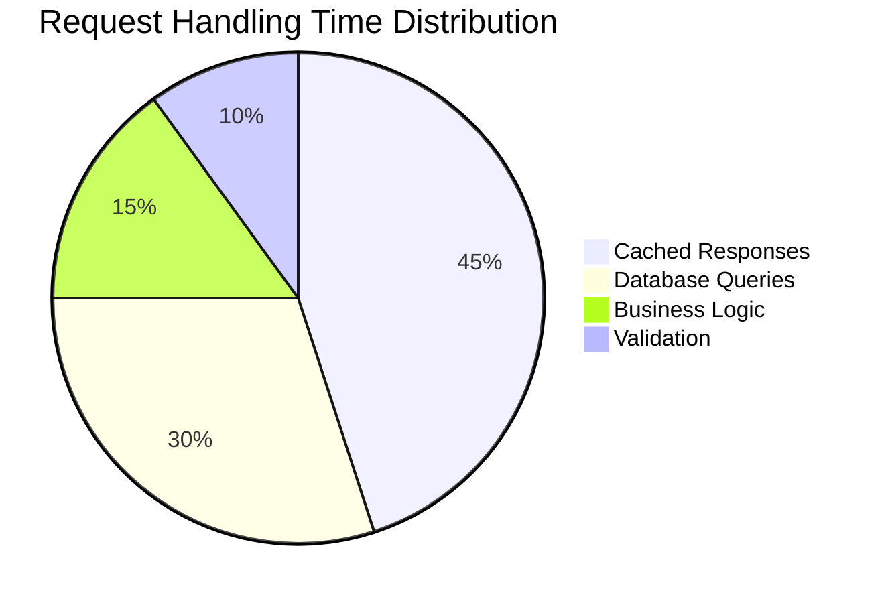

# 💳 FinBankDMO - Digital Banking System

## 🧾 Overview

**FinBankDMO** is a full-featured digital banking system designed to simulate real-world banking functionalities. The system includes account management, secure transactions, interest calculations, email OTP verification, and automatic scheduling powered by Hangfire.

---

## 🚀 Features

- ✅ Account Creation with AES-256 Encryption
- 🔠Secure Transactions (Transfer / Deposit / Withdraw)
- 💰 Interest Management System (Daily, Monthly, Yearly)
- 🕒 Automatic Scheduling via Hangfire
- 📧 Email Verification via OTP (Gmail SMTP)
- 🔔 Real-time Notifications using MediatR Events
- 📊 Paginated data for performance optimization
- 🧾 Audit Logging for all sensitive operations
- 👤 Role & Policy Based Authorization (with Claims support)
- 🧭 Clean Architecture with strict separation of concerns
- 💫 Mapping using **Mapperly** (build-time generated mapping)
- 🔠Logging using **Serilog**
- 🧠 Auto **Cache Filters** & **Behaviors** (to optimize performance)
- â— Auto **Exception Filters** & **Behaviors** (for centralized error handling)
- âš ï¸ Global Exception Middleware for uncaught errors

---

## ğŸ› ï¸ Tech Stack

| Layer           | Tools/Frameworks |
|----------------|------------------|
| **Backend**    | ASP.NET Core Web API, MediatR, Entity Framework Core |
| **Database**   | SQL Server |
| **Scheduling** | Hangfire |
| **Auth**       | ASP.NET Core Identity + JWT + Roles & Policies |
| **Email**      | MailKit + Gmail App Password |
| **Security**   | AES Encryption (using `System.Security.Cryptography`) |
| **Logging**    | Serilog + Custom Audit Logging |
| **Architecture** | Clean Architecture + Unit of Work + Repository Pattern |

---


## 🌠System Workflow Visualization

### 🔄 End-to-End Request Flow

```mermaid
sequenceDiagram
    participant Client
    participant Middleware
    participant Filters
    participant Controller
    participant MediatR
    participant Repository
    participant Database
    
    Client->>Middleware: HTTP Request
    Middleware->>Middleware: Global Exception Handling
    Middleware->>Filters: Forward Request
    Filters->>Filters: Check Cache (GET requests)
    alt Cached Response Found
        Filters-->>Client: Return Cached Data
    else Not Cached
        Filters->>Controller: Forward Request
        Controller->>MediatR: Send Command/Query
        MediatR->>Repository: Process Business Logic
        Repository->>Database: Execute Query
        Database-->>Repository: Return Data
        Repository-->>MediatR: Return Result
        MediatR-->>Controller: Return Response
        Controller->>Filters: Return Response
        Filters->>Filters: Cache Response (if GET)
        Filters-->>Client: Return Fresh Data
    end
```
###ğŸ›¡ï¸ Exception Handling Flow
```mermaid
graph TD
    A[Request] --> B{Middleware}
    B -->|Exception| C[Log with Serilog]
    C --> D[Create Error Response]
    D --> E[Return Standardized Error]
    
    F[Controller] --> G{Exception Filter}
    G -->|Business Exception| H[Custom Status Code]
    G -->|Other| B
    
    I[MediatR] --> J{Behavior}
    J -->|Validation| K[Return 400]
    J -->|Other| B
  ```  
###💾 Caching Mechanism
```mermaid
flowchart LR
    A[Incoming Request] --> B{GET Request?}
    B -->|Yes| C[Generate Cache Key]
    C --> D{Exists in Cache?}
    D -->|Yes| E[Return Cached]
    D -->|No| F[Execute Request]
    F --> G[Cache Response]
    G --> H[Return Fresh Data]
    B -->|No| I[Process Normally]
```
###📊 Performance Metrics

```mermaid
pie
    title Request Handling Time Distribution
    "Cached Responses" : 45
    "Database Queries" : 30
    "Business Logic" : 15
    "Validation" : 10
```

    ## 🨠FinBankDMO UI/UX Flow (Arabic Support)

# 🦠FinBankDMO Digital Banking UI/UX Flow

## 🌟 Interactive User Journey

```mermaid
%%{init: {'theme':'neutral', 'themeVariables': { 'primaryColor': '#1a237e', 'edgeLabelBackground':'#fff'}}}%%
journey
    title User Flow with Emotional Engagement
    section Authentication
      Landing Page: 5: User(👤)
      OTP Verification: 3: User(😕), System(📱)
      Dashboard Load: 4: User(😊)
    section Transactions
      Initiate Transfer: 5: User(👆), System(💸)
      Email Confirmation: 3: User(📧), System(🔄)
      Success Notification: 4: User(😃), System(✅)
    section Interest
      View Earnings: 4: User(ğŸ§), System(📊)
      Auto-Apply: 5: System(🤖)
      Notification: 3: User(😮), System(🔔)
    


