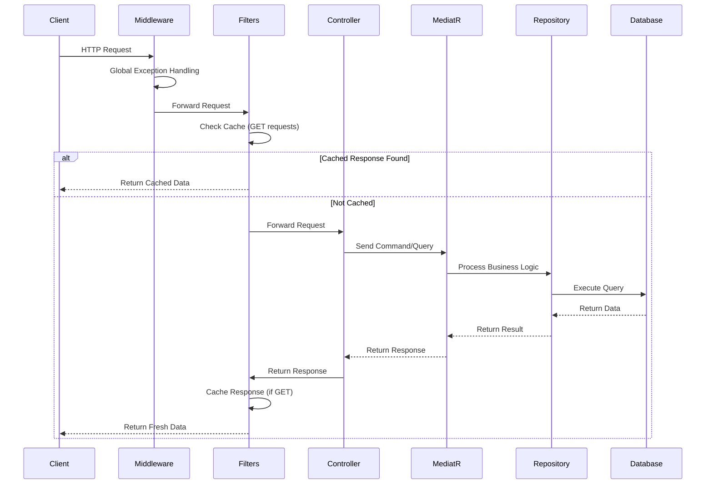
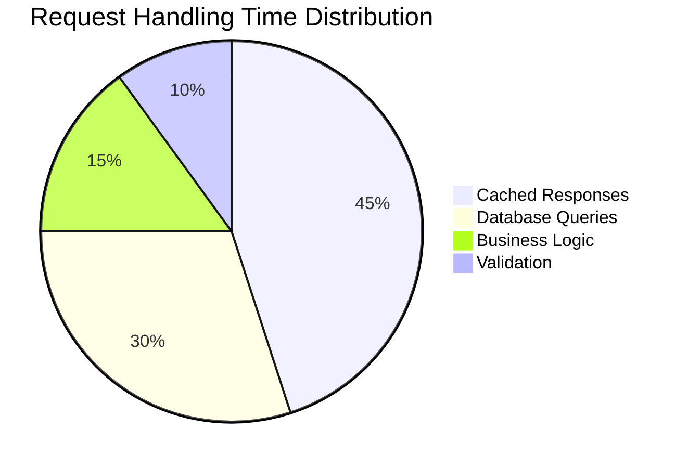

# 💳 FinBankDMO - Digital Banking System

## 🧾 Overview

**FinBankDMO** is a full-featured digital banking system designed to simulate real-world banking functionalities. The system includes account management, secure transactions, interest calculations, email OTP verification, and automatic scheduling powered by Hangfire.

---

## 🚀 Features

- ✅ Account Creation with AES-256 Encryption
- 🔐 Secure Transactions (Transfer / Deposit / Withdraw)
- 💰 Interest Management System (Daily, Monthly, Yearly)
- 🕒 Automatic Scheduling via Hangfire
- 📧 Email Verification via OTP (Gmail SMTP)
- 🔔 Real-time Notifications using MediatR Events
- 📊 Paginated data for performance optimization
- 🧾 Audit Logging for all sensitive operations
- 👤 Role & Policy Based Authorization (with Claims support)
- 🧭 Clean Architecture with strict separation of concerns
- 💫 Mapping using **Mapperly** (build-time generated mapping)
- 🔍 Logging using **Serilog**
- 🧠 Auto **Cache Filters** & **Behaviors** (to optimize performance)
- ❗ Auto **Exception Filters** & **Behaviors** (for centralized error handling)
- ⚠️ Global Exception Middleware for uncaught errors

---

## 🛠️ Tech Stack

| Layer           | Tools/Frameworks |
|----------------|------------------|
| **Backend**    | ASP.NET Core Web API, MediatR, Entity Framework Core |
| **Database**   | SQL Server |
| **Scheduling** | Hangfire |
| **Auth**       | ASP.NET Core Identity + JWT + Roles & Policies |
| **Email**      | MailKit + Gmail App Password |
| **Security**   | AES Encryption (using `System.Security.Cryptography`) |
| **Logging**    | Serilog + Custom Audit Logging |
| **Architecture** | Clean Architecture + Unit of Work + Repository Pattern |

---

# 🏦 FinBankDMO Digital Banking UI/UX Flow

```mermaid
flowchart TD
    A[🌐 Login Page] -->|Login| B[🔐 OTP Verification]
    B --> C[🏠 Dashboard]

    %% Account Management
    subgraph "Account Management"
        C --> D[💳 Create New Account]
        D --> E[🔢 Enter Details]
        E --> F[🔐 Encrypt with AES-256]
    end

    %% Transactions
    subgraph "Transactions"
        C --> G[🔄 Transfer Funds]
        C --> H[💰 Deposit]
        C --> I[💸 Withdraw]
        G --> J[📧 Email Confirmation]
    end

    %% Interest Management
    subgraph "Interest Management"
        C --> K[📈 View Interest]
        K --> L[🗓 Schedule Interest]
        L --> M[🔄 Auto Update via Hangfire]
    end

    %% Settings
    subgraph "Settings"
        C --> N[⚙️ Profile Settings]
        N --> O[✉️ Update Email]
        N --> P[🔑 Change Password]
    end

    %% Colors
    style A fill:#4CAF50,stroke:#388E3C,color:#fff
    style B fill:#FFC107,stroke:#FFA000,color:#000
    style C fill:#2196F3,stroke:#0D47A1,color:#fff
    style D fill:#9C27B0,stroke:#7B1FA2,color:#fff
    style G fill:#3F51B5,stroke:#303F9F,color:#fff
    style K fill:#009688,stroke:#00796B,color:#fff

    %% Legend
    Z[🎨 Color Legend] --> Z1
    subgraph Z1[ ]
        direction LR
        Z2[🟩 Green: Authentication]
        Z3[🟦 Blue: Main Operations]
        Z4[🟪 Purple: Account Management]
    end
```


## 🌐 System Workflow Visualization

### 🔄 End-to-End Request Flow

###🛡️ Exception Handling Flow
```mermaid
graph TD
    A[Request] --> B{Middleware}
    B -->|Exception| C[Log with Serilog]
    C --> D[Create Error Response]
    D --> E[Return Standardized Error]
    
    F[Controller] --> G{Exception Filter}
    G -->|Business Exception| H[Custom Status Code]
    G -->|Other| B
    
    I[MediatR] --> J{Behavior}
    J -->|Validation| K[Return 400]
    J -->|Other| B
  ```  
###💾 Caching Mechanism
```mermaid
flowchart LR
    A[Incoming Request] --> B{GET Request?}
    B -->|Yes| C[Generate Cache Key]
    C --> D{Exists in Cache?}
    D -->|Yes| E[Return Cached]
    D -->|No| F[Execute Request]
    F --> G[Cache Response]
    G --> H[Return Fresh Data]
    B -->|No| I[Process Normally]
```
###📊 Performance Metrics


## 🧪 How to Run Locally

```bash
# Clone the repo
git clone https://github.com/yourname/FinBankDMO.git

# Open in Visual Studio or VS Code

# Configure your appsettings.json:
- ConnectionStrings
- EmailSettings (SMTP, App Password)
- Encryption (Key, IV)

# Apply migrations and update DB
dotnet ef database update

# Run the API
dotnet run


