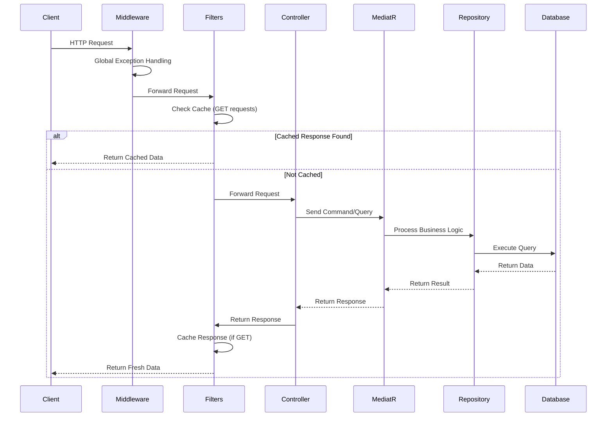
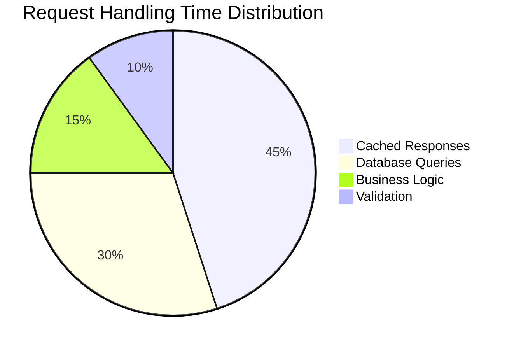

# 💳 FinBankDMO - Digital Banking System

## 🧾 Overview

**FinBankDMO** is a full-featured digital banking system designed to simulate real-world banking functionalities. The system includes account management, secure transactions, interest calculations, email OTP verification, and automatic scheduling powered by Hangfire.

---

## 🚀 Features

- ✅ Account Creation with AES-256 Encryption
- 🔐 Secure Transactions (Transfer / Deposit / Withdraw)
- 💰 Interest Management System (Daily, Monthly, Yearly)
- 🕒 Automatic Scheduling via Hangfire
- 📧 Email Verification via OTP (Gmail SMTP)
- 🔔 Real-time Notifications using MediatR Events
- 📊 Paginated data for performance optimization
- 🧾 Audit Logging for all sensitive operations
- 👤 Role & Policy Based Authorization (with Claims support)
- 🧭 Clean Architecture with strict separation of concerns
- 💫 Mapping using **Mapperly** (build-time generated mapping)
- 🔍 Logging using **Serilog**
- 🧠 Auto **Cache Filters** & **Behaviors** (to optimize performance)
- ❗ Auto **Exception Filters** & **Behaviors** (for centralized error handling)
- ⚠️ Global Exception Middleware for uncaught errors

---

## 🛠️ Tech Stack

| Layer           | Tools/Frameworks |
|----------------|------------------|
| **Backend**    | ASP.NET Core Web API, MediatR, Entity Framework Core |
| **Database**   | SQL Server |
| **Scheduling** | Hangfire |
| **Auth**       | ASP.NET Core Identity + JWT + Roles & Policies |
| **Email**      | MailKit + Gmail App Password |
| **Security**   | AES Encryption (using `System.Security.Cryptography`) |
| **Logging**    | Serilog + Custom Audit Logging |
| **Architecture** | Clean Architecture + Unit of Work + Repository Pattern |

---


## 🌐 System Workflow Visualization

### 🔄 End-to-End Request Flow

###🛡️ Exception Handling Flow
```mermaid
graph TD
    A[Request] --> B{Middleware}
    B -->|Exception| C[Log with Serilog]
    C --> D[Create Error Response]
    D --> E[Return Standardized Error]
    
    F[Controller] --> G{Exception Filter}
    G -->|Business Exception| H[Custom Status Code]
    G -->|Other| B
    
    I[MediatR] --> J{Behavior}
    J -->|Validation| K[Return 400]
    J -->|Other| B
  ```  
###💾 Caching Mechanism
```mermaid
flowchart LR
    A[Incoming Request] --> B{GET Request?}
    B -->|Yes| C[Generate Cache Key]
    C --> D{Exists in Cache?}
    D -->|Yes| E[Return Cached]
    D -->|No| F[Execute Request]
    F --> G[Cache Response]
    G --> H[Return Fresh Data]
    B -->|No| I[Process Normally]
```
###📊 Performance Metrics


    ## 🎨 FinBankDMO UI/UX Flow (Arabic Support)

```mermaid
flowchart TD
    A[🌐 صفحة الدخول] -->|تسجيل الدخول| B[🔐 التحقق بOTP]
    B --> C[🏠 لوحة التحكم]
    
    subgraph "إدارة الحسابات (Accounts)"
        C --> D[💳 إنشاء حساب جديد]
        D --> E[🔢 إدخال التفاصيل]
        E --> F[🔐 تشفير AES-256]
    end
    
    subgraph "المعاملات (Transactions)"
        C --> G[🔄 تحويل الأموال]
        C --> H[💰 إيداع]
        C --> I[💸 سحب]
        G --> J[📧 تأكيد بالبريد]
    end
    
    subgraph "الفوائد (Interest)"
        C --> K[📈 عرض الفوائد]
        K --> L[🗓 جدولة الفوائد]
        L --> M[🔄 تحديث تلقائي]
    end
    
    subgraph "الإعدادات (Settings)"
        C --> N[⚙️ الملف الشخصي]
        N --> O[✉️ تحديث الإيميل]
        N --> P[🔑 تغيير كلمة السر]
    end
    
    style A fill:#4CAF50,stroke:#388E3C
    style B fill:#FFC107,stroke:#FFA000
    style C fill:#2196F3,stroke:#0D47A1
    style D fill:#9C27B0,stroke:#7B1FA2
    style G fill:#3F51B5,stroke:#303F9F
    style K fill:#009688,stroke:#00796B
    
    %% Legend
    Z[🎨 ألوان الواجهة:] --> Z1
    subgraph Z1[ ]
        direction LR
        Z2[أخضر: عمليات الدخول]
        Z3[أزرق: العمليات الرئيسية]
        Z4[بنفسجي: إدارة الحسابات]
    end
    


